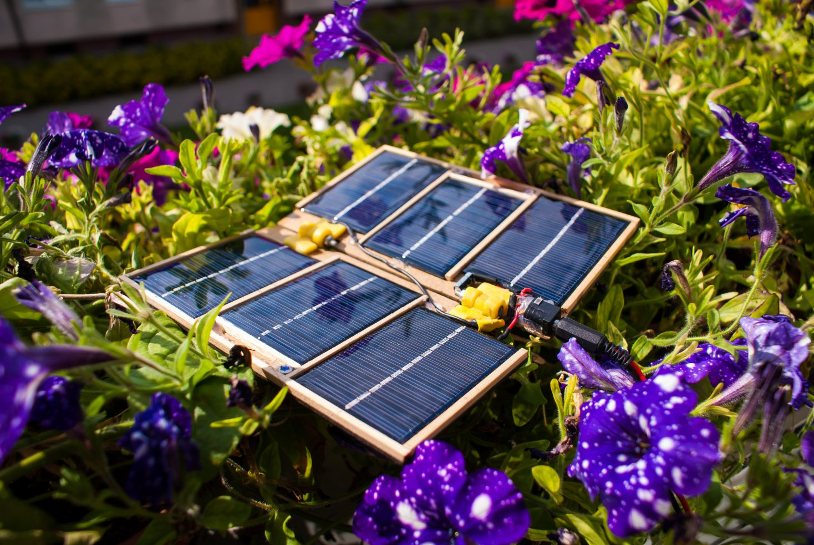
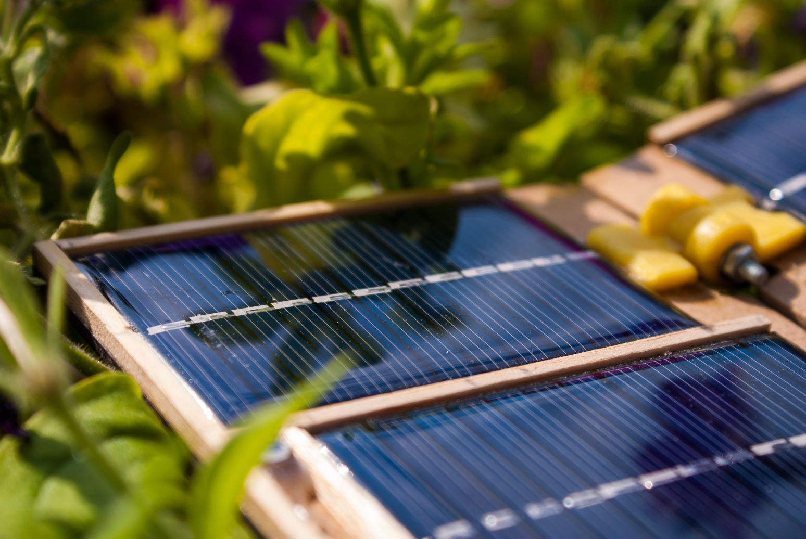
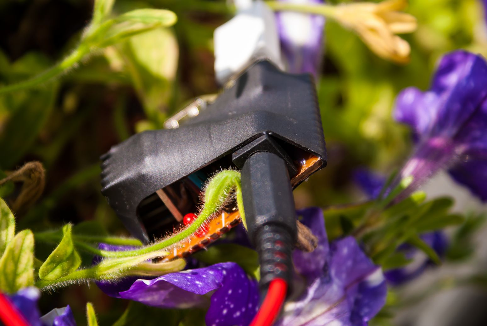
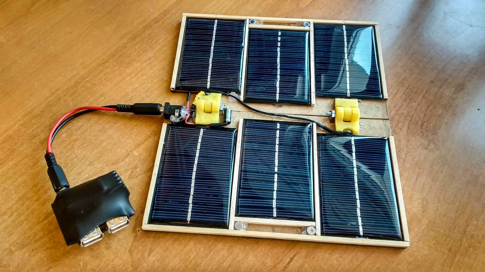

# Flare

_A lightweight, solar powered USB charger_

## About
  During a sunny day it can provide over 1A of current at 5V. That is more than enough to charge a smartphone or power a microcontroller (or both simultaneously). The output voltage is limited by the external voltage regulator module.

## Hardware
  - 6 x Photovoltaic Cell (6V 200mA)
  - Female USB sockets
  - DC jack sockets
  - Electrolytic capacitors
  - An LDO 5.0V regulator (LM7805 or LM2940T-5.0V for ex.)
  - LED, appropriate resistor and a switch for status display (optional)
  - Some wood, hinges, screws and nuts
  
## Images

